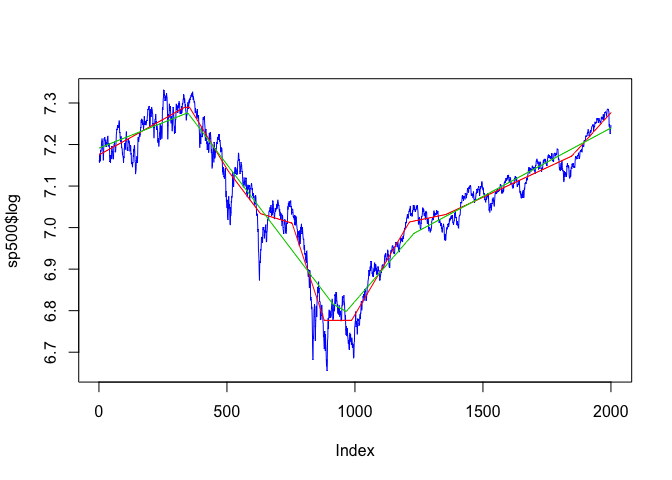

<!-- README.md is generated from README.Rmd. Please edit that file -->

# l1tf: l1 trend filtering

<!-- badges: start -->
<!-- badges: end -->

This is an R package wrapper around the C solver for the [l1 trend
filtering algorithm](https://web.stanford.edu/~boyd/l1_tf/) written by
Kwangmoo Koh, Seung-Jean Kim and Stephen Boyd.

## Installation

You can install the development version of l1tf from
[GitHub](https://github.com/) with:

``` r
# install.packages("devtools")
devtools::install_github("hadley/l1tf")
```

## Examples

``` r
library(l1tf)
plot(sp500$log, type='l', col='blue')
lines(l1tf(sp500$log, lambda = 50), col = "red", type='l')
lines(l1tf(sp500$log, prop = 0.01), col = "green3", type='l')
#> Using lambda 374
```


